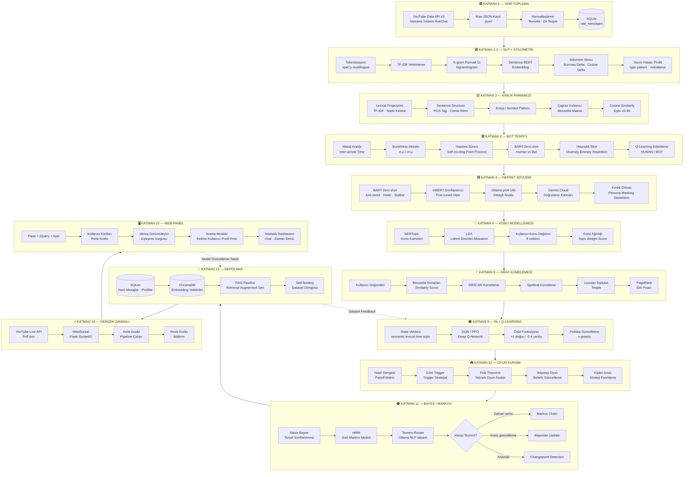
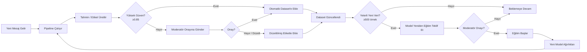
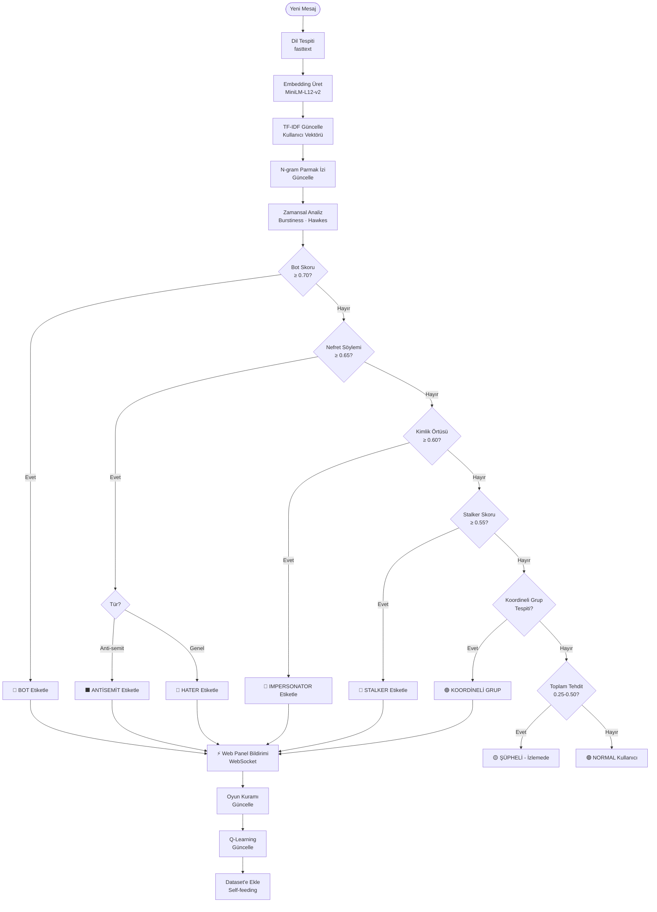

# 🛡️ YT GUARDIAN — TAM MİMARİ TASARIM BELGESİ
**YouTube Kanal Moderasyon · Kimlik Eşleme · Bot & Nefret Söylemi Tespit Sistemi**  
**Kanal:** [@ShmirchikArt/streams](https://www.youtube.com/@ShmirchikArt/streams)  
**Donanım:** AMD Ryzen 9 9900X · AMD RX 7900 XT (ROCm/HIP) · Ollama `phi4:14b` + Gemini Cloud  
**Versiyon:** 2.0 — 2024-2026 Aralığı · Çok-dilli · Gerçek Zamanlı  

---

## İÇİNDEKİLER

1. [Sistem Genel Bakışı](#1-sistem-genel-bakışı)
2. [Mimari Akış Şeması (Mermaid)](#2-mimari-akış-şeması-mermaid)
3. [Katman 0 — Veri Toplama ve Normalleştirme](#3-katman-0--veri-toplama-ve-normalleştirme)
4. [Katman 1 — NLP Pipeline (Çok-dilli)](#4-katman-1--nlp-pipeline-çok-dilli)
5. [Katman 2 — Stilometri ve Kimlik Parmak İzi](#5-katman-2--stilometri-ve-kimlik-parmak-izi)
6. [Katman 3 — Bot Tespiti](#6-katman-3--bot-tespiti)
7. [Katman 4 — Nefret Söylemi · Anti-Semitizm · Stalker Analizi](#7-katman-4--nefret-söylemi--anti-semitizm--stalker-analizi)
8. [Katman 5 — Kimlik Örtüsü Tespiti (Persona Masking)](#8-katman-5--kimlik-örtüsü-tespiti-persona-masking)
9. [Katman 6 — Konu Modelleme (Topic Modeling)](#9-katman-6--konu-modelleme-topic-modeling)
10. [Katman 7 — Zamansal ve Davranışsal Analiz](#10-katman-7--zamansal-ve-davranışsal-analiz)
11. [Katman 8 — Graf Kümeleme ve İlişki Ağı](#11-katman-8--graf-kümeleme-ve-ilişki-ağı)
12. [Katman 9 — Q-Learning / Pekiştirmeli Öğrenme](#12-katman-9--q-learning--pekiştirmeli-öğrenme)
13. [Katman 10 — Oyun Kuramı Modülü](#13-katman-10--oyun-kuramı-modülü)
14. [Katman 11 — Bayesçi / Markov Modeli ve Teorem Yönlendirici](#14-katman-11--bayesçi--markov-modeli-ve-teorem-yönlendirici)
15. [Katman 12 — İstatistiksel ve Matematiksel Temel](#15-katman-12--istatistiksel-ve-matematiksel-temel)
16. [Katman 13 — Depolama (SQLite + ChromaDB + RAG)](#16-katman-13--depolama-sqlite--chromadb--rag)
17. [Katman 14 — Gerçek Zamanlı Akış Monitörü](#17-katman-14--gerçek-zamanlı-akış-monitörü)
18. [Katman 15 — Web Panel Tasarımı](#18-katman-15--web-panel-tasarımı)
19. [Tehdit Renk Kodlama Sistemi](#19-tehdit-renk-kodlama-sistemi)
20. [Ollama + Gemini Entegrasyonu](#20-ollama--gemini-entegrasyonu)
21. [CLIP Görsel Embedding Modülü](#21-clip-görsel-embedding-modülü)
22. [Self-Feeding Dataset Döngüsü](#22-self-feeding-dataset-döngüsü)
23. [Mesaj Formatı ve Arayüz Arama Modülü](#23-mesaj-formatı-ve-arayüz-arama-modülü)
24. [Modül Bağımlılık Tablosu](#24-modül-bağımlılık-tablosu)
25. [Python Mimarisi: Dosya ve Paket Yapısı](#25-python-mimarisi-dosya-ve-paket-yapısı)
26. [Güvenlik Kapısı ve İnceleme Kuyruğu](#26-güvenlik-kapısı-ve-inceleme-kuyruğu)

---

## 1. Sistem Genel Bakışı

YT Guardian, YouTube canlı yayın sohbet geçmişlerini, replay sohbetlerini ve yorum bölümlerini **çok-dilli, çok-katmanlı bir yapay zeka pipeline'ı** ile işleyen bir moderasyon ve tehdit tespiti sistemidir.

### Birincil Hedefler

| Hedef | Yöntem |
|---|---|
| Aynı kişinin farklı hesaplarını birbirine bağlama | Identity Linkage (Stilometri + Embedding + Graf) |
| Bot hesaplarını tespit etme | Davranışsal + NLP + Q-Learning |
| Anti-semitizm / nefret söylemi tespiti | Zero-shot + Fine-tuned BERT + BART + Ollama |
| Kimlik örtüsü (başka biri gibi davranma) tespiti | Persona Masking Dedektörü |
| Stalker örüntülerini tanıma | Zamansal Analiz + Hawkes Süreci |
| Gerçek zamanlı bildirim | Renk-kodlu Web Panel + WebSocket |
| Sürekli öğrenme | Self-feeding Dataset + Model Güncelleme |

### Desteklenen Diller

`Türkçe · İngilizce · İbranice · Arapça · Rusça · Farsça · Yidişçe · Hintçe · Almanca · Fransızca`  
→ Dil tespiti için: **`fasttext` (lid.176.bin)** + **`langdetect`**  
→ Çok-dilli embedding için: **`paraphrase-multilingual-MiniLM-L12-v2`** (sentence-transformers)

---

## 2. Mimari Akış Şeması (Mermaid)



---

## 3. Katman 0 — Veri Toplama ve Normalleştirme

### 3.1 YouTube Veri Kaynakları

| Kaynak | Yöntem | Notlar |
|---|---|---|
| Canlı yayın replay sohbetleri | `get_live_chat_replay` continuation token | Zaman damgası μsec |
| Video yorum bölümleri | YouTube Data API v3 `commentThreads.list` | OAuth2 gerekebilir |
| Video meta (başlık, tarih, açıklama) | `ytInitialData` HTML parsing | `og:title` + `uploadDate` |
| Gerçek zamanlı canlı yayın | `get_live_chat` Poll (5 sn aralıklı) | WebSocket'e aktarılır |

### 3.2 Normalleştirme Pipeline

```
Ham Metin
  → Unicode Normalize (NFC)
  → HTML Entity Decode (&amp; → &)
  → Emoji Ayrıştır (unicode kategorisi Emoji_Presentation)
  → Dil Tespiti: fasttext lid.176.bin (güven eşiği ≥ 0.65)
  → Script Tespiti: Arabic / Hebrew / Cyrillic / Latin / Devanagari
  → Timestamp Normalleştir (UTC epoch → ISO 8601)
  → Anonim Takma Ad Normalleştir (Unicode homograph saldırısı tespiti)
```

### 3.3 Mesaj Formatı (Standart)

```json
{
  "msg_id": "sha256_hash",
  "video_id": "xxxxxxxxxxx",
  "title": "Stream Title",
  "video_date": "2024-11-15",
  "author": "kullanici_adi",
  "author_channel_id": "UCxxxxxxxx",
  "message": "Mesaj içeriği burada",
  "timestamp_utc": 1731680400,
  "timestamp_iso": "2024-11-15T18:00:00Z",
  "lang_detected": "he",
  "lang_confidence": 0.94,
  "script": "Hebrew",
  "source_type": "replay_chat",
  "emojis": ["🔥", "😂"],
  "is_live": false
}
```

---

## 26. Güvenlik Kapısı ve İnceleme Kuyruğu

Üretim kullanımında yanlış pozitif riskini azaltmak ve hesap güvenliğini artırmak için:

- **Destructive Action Gate**: yorum silme/canlı chat silme gibi işlemler varsayılan olarak kapalıdır (`allow_destructive_actions=false`).
- **Credential Policy**: düz metin şifre yerine `YT_EMAIL` ve `YT_PASSWORD` ortam değişkenleri zorunlu tutulur (`require_env_credentials=true`).
- **Delete Candidate Queue**: sistem, otomatik silme yerine risk skoruna göre moderatör inceleme kuyruğu üretir.

### Önerilen Akış

1. Veri çekimi + analiz (2023-2026 aralığı).
2. `threat_score`, `hate_score`, `bot_prob`, `stalker_score` birleşik skor hesaplama.
3. Panelde **inceleme adayı** listesi yayınlama.
4. Moderatör onayı sonrası manuel aksiyon.

Bu model, hatalı/aceleli otomatik moderasyon kararlarının etkisini azaltır.

### 3.4 Homograph Saldırısı Tespiti

Siril "`а`" (U+0430) ile Latin "`a`" (U+0061) gibi görsel benzer karakterler aynı hesabın farklı isimlerde görünmesini sağlar. Tespit:

```python
import unicodedata

def normalize_username(name: str) -> str:
    # NFKC normalleştirme: görsel benzer karakterleri standartlaştır
    return unicodedata.normalize("NFKC", name).lower().strip()
```

---

## 4. Katman 1 — NLP Pipeline (Çok-dilli)

### 4.1 Kullanılan Modeller

| Model | Görev | Notlar |
|---|---|---|
| `paraphrase-multilingual-MiniLM-L12-v2` | Cümle embedding (50+ dil) | CPU'da hızlı |
| `facebook/bart-large-mnli` | Zero-shot sınıflandırma | ROCm ile GPU |
| `bert-base-multilingual-cased` (mBERT) | Token sınıflandırma, NER | |
| `Helsinki-NLP/opus-mt-*` | Çeviri (Arapça/İbranice → İngilizce) | Opsiyonel |
| `fasttext lid.176.bin` | Dil tespiti | 176 dil desteği |
| spaCy `xx_ent_wiki_sm` | Çok-dilli NER, POS | |
| Ollama `phi4:14b` | Derin analiz, açıklama, sorgulama | Lokal CPU/GPU |
| Gemini Cloud (`gemini-1.5-flash`) | Doğrulama, zor vakalar | API çağrısı |

### 4.2 TF-IDF Vektörleme

Belge-terim matrisi:

$$\text{TF-IDF}(t, d, D) = \underbrace{\frac{f_{t,d}}{\sum_{t' \in d} f_{t',d}}}_{\text{TF}} \times \underbrace{\log\frac{|D|}{|\{d \in D : t \in d\}|}}_{\text{IDF}}$$

Uygulama: Her kullanıcının tüm mesajları tek belge olarak birleştirilir. Karakteristik kelimeler (nadir, kişiye özgü) yüksek ağırlık alır.

### 4.3 N-gram Parmak İzi

Bigram ve trigram frekans dağılımı her kullanıcı için bir parmak izi oluşturur:

$$\text{NGramSim}(u_i, u_j) = \frac{|\mathcal{N}(u_i) \cap \mathcal{N}(u_j)|}{|\mathcal{N}(u_i) \cup \mathcal{N}(u_j)|}$$

Bu **Jaccard benzerliğidir**. N-gramlar karakteristik yazım kalıplarını ("/aslında biliyorum ki", "yani demek istediğim") yakalar.

### 4.4 Cümle Embedding ve Cosine Benzerliği

$$\text{CosSim}(\mathbf{u}, \mathbf{v}) = \frac{\mathbf{u} \cdot \mathbf{v}}{\|\mathbf{u}\| \|\mathbf{v}\|}$$

Eşik değerleri:

| Skor | Yorum |
|---|---|
| ≥ 0.90 | Çok yüksek ihtimalle aynı kişi |
| 0.80–0.90 | Yüksek ihtimalle aynı kişi |
| 0.65–0.80 | İncelenmeye değer |
| < 0.65 | Muhtemelen farklı kişiler |

### 4.5 POS Tag Analizi

spaCy ile her kullanıcı için Part-of-Speech dağılımı çıkarılır:

```python
def pos_profile(doc) -> dict:
    counts = Counter(token.pos_ for token in doc)
    total = len(doc)
    return {pos: count/total for pos, count in counts.items()}
```

Noun/Verb oranı, soru cümleleri sıklığı, imperativ kullanımı — hepsi kimlik kalıbı oluşturur.

---

## 5. Katman 2 — Stilometri ve Kimlik Parmak İzi

### 5.1 Burrows Delta (Klasik Stilometri)

En sağlam stilometrik mesafe metriklerinden biri. Z-skor normalleştirilmiş kelime frekansları üzerinden:

$$\Delta(A, B) = \frac{1}{n} \sum_{i=1}^{n} \left| z_i(A) - z_i(B) \right|$$

Burada:
- $z_i(A) = \frac{f_i(A) - \mu_i}{\sigma_i}$ — yazar A'nın i. kelimedeki z-skoru
- $\mu_i$, $\sigma_i$ — tüm yazarlardaki i. kelimenin ortalama ve standart sapması

Düşük $\Delta$ → aynı yazar ihtimali yüksek.

### 5.2 Cosine Delta (Geliştirilmiş Burrows)

$$\Delta_C(A, B) = 1 - \frac{\mathbf{z}(A) \cdot \mathbf{z}(B)}{\|\mathbf{z}(A)\| \|\mathbf{z}(B)\|}$$

CNN modeli, karakter 3-gramları ve kelime 1-gramlarını en etkili özellikler olarak kullanarak tüm veri setlerinde en iyi performansı göstermektedir. Bu sistem de karakter-gram + kelime-gram kombinasyonunu kullanır.

### 5.3 Yazım Hatası Profili (Typo Pattern)

```python
def typo_fingerprint(messages: list[str]) -> dict:
    patterns = {
        "double_letters": re.findall(r"(\w)\1{2,}", " ".join(messages)),
        "missing_vowels": ...,  # örn: "thnk" → "think"
        "transposition": ...,   # örn: "teh" → "the"
        "capitalization_style": uppercase_ratio(" ".join(messages)),
        "punctuation_density": punctuation_ratio(" ".join(messages)),
        "ellipsis_use": text.count("...") / max(1, len(messages)),
        "trailing_spaces": ...,
    }
    return patterns
```

### 5.4 Çapraz Kullanıcı Benzerlik Matrisi

$N$ kullanıcı için $N \times N$ boyutunda simetrik benzerlik matrisi:

$$\mathbf{S}_{ij} = w_1 \cdot \text{EmbSim}(i,j) + w_2 \cdot \text{NGramSim}(i,j) + w_3 \cdot \text{TypoSim}(i,j) + w_4 \cdot \text{TimeSim}(i,j) + w_5 \cdot \text{TopicSim}(i,j)$$

Ağırlıklar Q-Learning ile dinamik olarak güncellenir: başlangıç değerleri $w = [0.35, 0.25, 0.15, 0.15, 0.10]$.

### 5.5 Jensen-Shannon Sapması (Konu Dağılımı Karşılaştırma)

İki kullanıcının konu dağılımı $P$ ve $Q$ arasındaki simetrik mesafe:

$$\text{JSD}(P \| Q) = \frac{1}{2} \text{KL}(P \| M) + \frac{1}{2} \text{KL}(Q \| M), \quad M = \frac{P+Q}{2}$$

$$\text{KL}(P \| Q) = \sum_i P(i) \log \frac{P(i)}{Q(i)}$$

Düşük JSD → benzer konu dağılımı → aynı kişi ihtimali artar.

---

## 6. Katman 3 — Bot Tespiti

### 6.1 Burstiness (Patlamalı Aktivite)

İnsan mesajları düzensizken, botlar düzenli aralıklarla veya kısa patlama dönemlerinde mesaj atar. Burstiness metriki:

$$B = \frac{\sigma_{\Delta t} - \mu_{\Delta t}}{\sigma_{\Delta t} + \mu_{\Delta t}}$$

| B değeri | Yorum |
|---|---|
| B → +1 | Çok patlamalı (atak / koordineli bot grubu) |
| B → 0 | Rastsal (normal insan) |
| B → -1 | Çok düzenli (basit bot) |

### 6.2 Hawkes Süreci (Self-Exciting Point Process)

Özellikle bot koordinasyonu ve stalker izleme örüntüleri için:

$$\lambda(t) = \mu + \sum_{t_i < t} \phi(t - t_i)$$

Burada:
- $\mu$ — temel tetiklenme oranı (background rate)
- $\phi(t - t_i) = \alpha e^{-\beta(t - t_i)}$ — geçmiş olayların etkisi (kernel fonksiyonu)

Hawkes süreci, bir kullanıcının başka bir kullanıcının mesajından hemen sonra yazan kişi olup olmadığını modellemek için idealdir — stalker davranışının matematiksel tanımı.

### 6.3 Heuristik Bot Skoru

$$\text{BotScore}(u) = 1 - \left[ 0.28 \cdot D + 0.18 \cdot \frac{H}{4.5} + 0.12 \cdot \frac{\bar{L}}{80} + 0.10 \cdot Q + 0.10 \cdot P + 0.07 \cdot E + 0.05(1 - U) + 0.10(1 - R) \right]$$

| Sembol | Açıklama |
|---|---|
| $D$ | Lexical diversity (unique/total token oranı) |
| $H$ | Shannon entropi (karakter düzeyinde) |
| $\bar{L}$ | Ortalama mesaj uzunluğu |
| $Q$ | Soru cümlesi oranı |
| $P$ | Noktalama yoğunluğu |
| $E$ | Emoji yoğunluğu |
| $U$ | Büyük harf oranı |
| $R$ | Tekrar skoru (ardışık mesaj benzerliği) |

### 6.4 Shannon Entropi (Karakter Düzeyinde)

$$H(X) = -\sum_{c \in \Sigma} p(c) \log_2 p(c)$$

Düşük entropi → monoton / bot benzeri metin. Yüksek entropi → karmaşık / insani metin.

### 6.5 BART Zero-Shot Sınıflandırma

```python
labels = ["human-like conversation", "spam or bot-like message"]
result = bart_pipeline(text[:512], candidate_labels=labels,
                       hypothesis_template="This text is {}.")
```

Nihai bot skoru: $0.55 \times \text{BART} + 0.45 \times \text{Heuristik}$

---

## 7. Katman 4 — Nefret Söylemi · Anti-Semitizm · Stalker Analizi

### 7.1 Tehdit Kategorileri

| Kategori | Tanım | Model |
|---|---|---|
| `ANTISEMITE` | Yahudi karşıtı söylem | BART + mBERT fine-tuned |
| `HATER` | Genel nefret söylemi | BART zero-shot |
| `STALKER` | Takıntılı/tekrarlayan ilgi örüntüsü | Hawkes + Temporal |
| `IMPERSONATOR` | Kimlik örtüsü (başka biri gibi davranma) | Persona Masking |
| `BOT` | Otomatik hesap | Q-Learning |
| `COORDINATED` | Koordineli saldırı grubu | Graf kümeleme |
| `SUSPICIOUS` | Şüpheli davranış | Çok-sinyal skoru |

### 7.2 Zero-Shot Sınıflandırma Etiketleri

```python
hate_labels = [
    "antisemitic content",
    "hate speech against Jewish people",
    "islamophobic content", 
    "white supremacist content",
    "harassment and stalking",
    "identity impersonation",
    "neutral friendly message",
    "bot-generated content"
]
```

### 7.3 Kimlik Profil Matrisi

Her kullanıcı için şu boyutlarda sürekli (0-1) olasılık vektörü tutulur:

```
KimlikVektörü = {
  # Din / İnanç
  "christian": 0.0,    "muslim": 0.0,    "jewish": 0.0,
  "atheist": 0.0,      "secular": 0.0,   "hindu": 0.0,
  # Etnik / Milliyetçi
  "german": 0.0,       "american": 0.0,  "israeli": 0.0,
  "arab": 0.0,         "turkish": 0.0,   "russian": 0.0,
  # Siyasi
  "far_left": 0.0,     "left": 0.0,      "center": 0.0,
  "right": 0.0,        "far_right": 0.0,
  # Tehdit
  "antisemite": 0.0,   "hater": 0.0,     "stalker": 0.0,
  "impersonator": 0.0, "bot_prob": 0.0,
}
```

Bu vektör Bayesçi güncellemelerle her yeni mesajda revize edilir.

### 7.4 Çok-Dilli Bağlam Analizi

İbranice ve Yidişçe için özel anahtar kelime listeleri:

```python
HEBREW_ANTISEMITE_SIGNALS = ["כסף", "קונספירציה", ...]  # bağlam bağımlı
YIDDISH_PATTERNS = ["אידישע", "כאַראַקטערן", ...]
ARABIC_EXTREMIST_PATTERNS = ["يهودي", "مؤامرة", ...]  # bağlam bağımlı
```

**Dikkat:** Bu kelimeler tek başına yeterli değildir; bağlamsal embedding ile birlikte değerlendirilir.

---

## 8. Katman 5 — Kimlik Örtüsü Tespiti (Persona Masking)

### 8.1 Problem Tanımı

Kişi X, Yahudi değilken Yahudi gibi, Alman değilken Alman gibi davranıyor. Bu **çelişki tespiti** problemidir:

$$\text{PersonaScore}(u) = \| \hat{\theta}_{language}(u) - \hat{\theta}_{identity}(u) \|_2$$

- $\hat{\theta}_{language}$: Dil/söylem örüntüsünden çıkarılan kimlik vektörü
- $\hat{\theta}_{identity}$: İddia edilen/beyan edilen kimlik vektörü

Yüksek fark → kimlik örtüsü şüphesi.

### 8.2 Örnek Dedektör: Yahudi-Gibi-Davranan-Anti-Semit

```python
def detect_persona_masking(user_profile: dict) -> float:
    jewish_language_score = user_profile["jewish"]          # NLP'den
    antisemite_score = user_profile["antisemite"]           # Hate detection'dan
    if antisemite_score > 0.6 and jewish_language_score > 0.5:
        # Çelişki! Yüksek anti-semitizm + Yahudi dili/kültürü taklit
        return antisemite_score * jewish_language_score
    return 0.0
```

### 8.3 Kültürel Bilgi Tutarlılığı Testi

Ollama phi4:14b ile sorgulama:

```
Prompt: "Bu kişi Yahudi/Alman/Amerikalı olduğunu ima ediyor. 
Mesajlarına bakarak bu kültürel kimliğe tutarlı mı uyuyor? 
Skor ver: 0.0 (hiç tutarlı değil) - 1.0 (tamamen tutarlı). 
Açıkla."
```

---

## 9. Katman 6 — Konu Modelleme (Topic Modeling)

### 9.1 BERTopic

Sentence-BERT embedding → UMAP boyut indirgeme → HDBSCAN kümeleme → c-TF-IDF konu özeti.

$$\text{c-TF-IDF}(t, c) = \frac{f_{t,c}}{|c|} \times \log\left(1 + \frac{A}{\sum_{j=1}^{|C|} f_{t,c_j}}\right)$$

### 9.2 LDA (Latent Dirichlet Allocation)

Her belge $d$, konu karışımı $\theta_d \sim \text{Dir}(\alpha)$ üzerinden üretilir:

$$P(\mathbf{w} | \alpha, \beta) = \int P(\theta | \alpha) \prod_{n=1}^{N} \sum_{z_n} P(z_n | \theta) P(w_n | z_n, \beta) \, d\theta$$

Her kullanıcı için $K$-boyutlu konu dağılımı vektörü $\theta_u$ elde edilir. Bu vektör JSD ile karşılaştırılır.

### 9.3 Yayın Konusu → Kullanıcı Konu Ağırlığı

Video başlığı ve açıklamasından çıkarılan konu, o yayındaki kullanıcıların mesajlarıyla karşılaştırılır:

$$\text{TopicRelevance}(u, v) = \text{CosSim}(\theta_u, \theta_v)$$

Konudan bağımsız mesaj atan kullanıcılar → bot veya spam şüphesi.

---

## 10. Katman 7 — Zamansal ve Davranışsal Analiz

### 10.1 Temporal Fingerprint (Zaman Parmak İzi)

Her kullanıcı için saatlik aktivite histogramı:

$$h_u = [c_0, c_1, ..., c_{23}], \quad \sum_{k=0}^{23} c_k = 1$$

İki kullanıcı arasındaki zamansal benzerlik:

$$\text{TimeSim}(u_i, u_j) = 1 - \frac{\| h_{u_i} - h_{u_j} \|_1}{2}$$

### 10.2 Inter-Arrival Time Dağılımı

İnsan mesaj geliş süreleri genellikle **log-normal** dağılım gösterir:

$$\Delta t \sim \text{LogNormal}(\mu_{ln}, \sigma_{ln})$$

Bot mesajları ise genellikle **Poisson** veya **sabit aralıklı** gelir. Kolmogorov-Smirnov testiyle ayrım yapılır:

$$D_{KS} = \sup_x |F_{\text{empirical}}(x) - F_{\text{theoretical}}(x)|$$

### 10.3 Aynı Yayına Eş Zamanlı Giriş

Farklı hesapların aynı yayına $\pm \delta$ dakika içinde girmesi:

```python
def co_entry_detection(events: list, delta_sec=300) -> list[tuple]:
    """δ=300 sn = 5 dakika içinde aynı yayına giren hesaplar"""
    co_entries = []
    for i, (user_a, ts_a) in enumerate(events):
        for user_b, ts_b in events[i+1:]:
            if abs(ts_a - ts_b) <= delta_sec:
                co_entries.append((user_a, user_b, abs(ts_a - ts_b)))
    return co_entries
```

### 10.4 Changepoint Detection (Davranış Kırılma Noktası)

PELT (Pruned Exact Linear Time) algoritması ile kullanıcı davranışındaki ani değişimler:

$$\sum_{i=1}^{m+1} \left[ \mathcal{C}(y_{\tau_{i-1}+1:\tau_i}) + \beta \right]$$

Davranış değişimi → hesap ele geçirilmesi veya koordineli eylem sinyali.

---

## 11. Katman 8 — Graf Kümeleme ve İlişki Ağı

### 11.1 Graf Modeli

- **Düğüm (node):** Her kullanıcı hesabı
- **Kenar (edge):** $\mathbf{S}_{ij} \geq \tau$ ise kenar eklenir (eşik $\tau = 0.65$)
- **Kenar ağırlığı:** $\mathbf{S}_{ij}$ bileşik benzerlik skoru

```python
import networkx as nx
G = nx.Graph()
for i, user_i in enumerate(users):
    for j, user_j in enumerate(users[i+1:], i+1):
        sim = similarity_matrix[i][j]
        if sim >= THRESHOLD:
            G.add_edge(user_i, user_j, weight=sim)
```

### 11.2 DBSCAN (Yoğunluk Tabanlı Kümeleme)

Küre şeklinde olmayan, gürültü içeren kümeleri bulur:

```
Parametreler:
  ε (epsilon): maksimum komşuluk mesafesi = 1 - threshold
  min_samples: minimum komşu sayısı = 2
Çıktı:
  cluster_id = -1 → gürültü (tek başına şüpheli)
  cluster_id ≥ 0  → koordineli grup
```

### 11.3 Spektral Kümeleme

Graf Laplacian $L = D - A$ üzerinden:

$$L\mathbf{v} = \lambda \mathbf{v}$$

İlk $k$ özvektör kullanılarak K-means uygulanır. Özellikle düzensiz şekilli grupları (ring, spiral) DBSCAN'dan daha iyi yakalar.

### 11.4 Louvain Topluluk Tespiti

Modülarite optimizasyonu:

$$Q = \frac{1}{2m} \sum_{ij} \left[ A_{ij} - \frac{k_i k_j}{2m} \right] \delta(c_i, c_j)$$

Büyük ağlarda hızlı ve etkili.

### 11.5 PageRank — Etki Skoru

Koordineli grup içindeki en etkili (lider) hesabı tespit eder:

$$PR(u) = \frac{1-d}{N} + d \sum_{v \in \text{in}(u)} \frac{PR(v)}{L(v)}$$

Yüksek PageRank + yüksek tehdit skoru = koordineli saldırının lider hesabı.

---

## 12. Katman 9 — Q-Learning / Pekiştirmeli Öğrenme

### 12.1 MDP Formülasyonu

**Durum Uzayı** $S$:

$$s = (s_1, s_2, s_3, s_4, s_5) \in \{0,...,9\}^5$$

| Boyut | Açıklama | Hesaplama |
|---|---|---|
| $s_1$ | Mesaj sayısı | $\min(9, \lfloor count / 5 \rfloor)$ |
| $s_2$ | Tekrar skoru | $\min(9, \lfloor R \times 10 \rfloor)$ |
| $s_3$ | Lexical diversity | $\min(9, \lfloor D \times 10 \rfloor)$ |
| $s_4$ | Human score | $\min(9, \lfloor HS \times 10 \rfloor)$ |
| $s_5$ | Burstiness | $\min(9, \lfloor (B+1)/2 \times 10 \rfloor)$ |

**Eylem Uzayı** $A$: `{0: HUMAN, 1: BOT, 2: HATER, 3: STALKER, 4: IMPERSONATOR, 5: COORDINATED}`

**Ödül Fonksiyonu**:

$$R(s, a) = \begin{cases} +1.0 & \text{doğru etiketleme (doğrulanmış)} \\ -0.4 & \text{yanlış etiketleme} \\ +0.2 & \text{yeni tutarlı sinyal eklendi} \end{cases}$$

**Bellman Güncelleme (Q-Learning)**:

$$Q(s,a) \leftarrow Q(s,a) + \alpha \left[ r + \gamma \max_{a'} Q(s',a') - Q(s,a) \right]$$

Parametreler: $\alpha = 0.15$ (öğrenme oranı), $\gamma = 0.90$ (iskonto faktörü), $\varepsilon = 0.1$ (keşif oranı, azalan).

### 12.2 Deep Q-Network (DQN)

Daha büyük durum uzayı için:

```
Giriş: [embedding(u) || temporal_features(u) || topic_vector(u)]  # ~256 boyut
Gizli: Linear(256) → ReLU → Linear(128) → ReLU → Linear(64) → ReLU
Çıkış: Linear(6)  # 6 eylem için Q değerleri
```

**Experience Replay:** `deque(maxlen=10000)` — kararlı öğrenme için.

**Target Network:** Her 100 adımda bir güncellenen ayrı ağırlık seti.

### 12.3 PPO (Proximal Policy Optimization)

Sürekli öğrenme ortamında kararlılık için:

$$L^{CLIP}(\theta) = \mathbb{E}_t \left[ \min\left(r_t(\theta)\hat{A}_t,\ \text{clip}(r_t(\theta), 1-\varepsilon, 1+\varepsilon)\hat{A}_t\right) \right]$$

---

## 13. Katman 10 — Oyun Kuramı Modülü

### 13.1 Temel Oyun Modeli

Sistem, moderatör ile kötü niyetli aktörler (botlar, haterlar) arasındaki **tekrarlayan iki-taraflı oyun** olarak modellenir.

**Oyuncular:** $\{$Moderatör $M$, Aktör $A_i\}$  
**Strateji Uzayı:**
- $M$: `{BAN, WARN, IGNORE, MONITOR}`
- $A_i$: `{BEHAVE, TROLL, IMPERSONATE, FLOOD, COORDINATE}`

### 13.2 Nash Dengesi Hesabı

SarNet, oyun kuramı ve Prisoner's Dilemma'yı temel alan Nash Equalizer modülü ile nefret ve alaycılığı sınıflandırmak için payoff matrisi kullanır.

Ödül matrisi $\mathbf{P}$ (moderatör bakış açısı):

```
              A: BEHAVE  A: TROLL  A: IMPERSONATE  A: FLOOD
M: BAN          (-1, -5)   (3, -3)     (5, -4)       (4, -3)
M: WARN         (1, 0)    (-1, -1)     (1, -2)       (0, -1)
M: IGNORE       (2, 2)    (-3, 3)     (-4, 4)       (-3, 3)
M: MONITOR      (1, 0)    (2, -1)      (3, -2)       (2, -1)
```

Nash Dengesi: Her iki oyuncunun tek taraflı saparak daha iyi sonuç alamayacağı strateji çifti.

**Hesaplama:**

```python
def find_nash_equilibrium(payoff_matrix: np.ndarray) -> list[tuple]:
    nash = []
    rows, cols = payoff_matrix.shape[0], payoff_matrix.shape[1]
    for i in range(rows):
        for j in range(cols):
            # Moderatör i. stratejiyle en iyi yanıt mı?
            mod_best = payoff_matrix[i, j, 0] == max(payoff_matrix[:, j, 0])
            # Aktör j. stratejiyle en iyi yanıt mı?
            act_best = payoff_matrix[i, j, 1] == max(payoff_matrix[i, :, 1])
            if mod_best and act_best:
                nash.append((i, j))
    return nash
```

### 13.3 Grim Trigger Stratejisi

Tekrarlayan oyunlarda caydırıcılık mekanizması:

```
Başlangıç: COOPERATE (hesabı tolere et)
Kural: Eğer aktör herhangi bir turda TROLL/FLOOD/IMPERSONATE seçerse
       → Sonraki tüm turlarda BAN (sonsuz ceza)
```

Matematiksel koşul (Grim Trigger'ın denge olması için):

$$\frac{V_{cooperate}}{1-\delta} \geq V_{defect} + \frac{\delta \cdot V_{punishment}}{1-\delta}$$

$\delta$: iskonto faktörü (aktörün geleceğe verdiği önem)

### 13.4 Folk Teoremi

Sonsuz tekrarlanan oyunlarda, aktörlerin sabırlı olduğu ($\delta$ yeterince büyük) her durumda:

$$\text{Her } (u_M, u_A) \in \mathcal{F}^* \text{ bireysel rasyonellik şartını sağlıyorsa → denge olarak uygulanabilir}$$

$\mathcal{F}^*$: Tüm mümkün ödeme vektörlerinin dışbükey kapsamı.

**Uygulaması:** Moderatör, uzun vadeli kötü niyetli aktörlere karşı tutarlı ban politikası uygulamalıdır — çünkü aktör "yarın da burada olacağını" bilirse uyum teşviki artar.

### 13.5 Tit-for-Tat

Axelrod'un ünlü turnuva stratejisi:

```
Tur 1: COOPERATE
Tur t > 1: Önceki turda aktörün ne yaptıysa onu yap
```

Sistemde uygulanması: Kullanıcı iyi davranırsa bildirim azalır; kötü davranırsa anında tepki verilir.

### 13.6 Bayesçi Oyun (Eksik Bilgi)

Moderatör, aktörün tipini ($\theta \in \{BOT, HATER, STALKER, NORMAL\}$) bilmez. Belief güncelleme:

$$P(\theta | \text{mesaj}) = \frac{P(\text{mesaj} | \theta) \cdot P(\theta)}{P(\text{mesaj})}$$

### 13.7 Signaling Oyunu

Aktör, kimliği hakkında sinyaller gönderiyor. Sistem bu sinyallerin `separating equilibrium` mi (gerçek tip açıklanıyor) yoksa `pooling equilibrium` mi (tip gizleniyor) olduğunu tespit eder.

### 13.8 Evrimsel Kararlı Strateji (ESS)

Büyük kullanıcı popülasyonunda hangi strateji kararlıdır:

$$\pi(s^*, s^*) > \pi(s, s^*) \quad \text{veya} \quad \pi(s^*, s^*) = \pi(s, s^*) \text{ ve } \pi(s^*, s) > \pi(s, s)$$

Bot koordinasyonunun "kararlı olmayan strateji" (invazyon imkânı var) olduğunu gösterir.

### 13.9 Stackelberg Oyunu

Moderatör **lider** (önce hareket eder), aktörler **takipçi** (tepki verir):

$$\max_{s_M} u_M(s_M, \text{BR}_A(s_M))$$

Moderatörün optimal ban eşiğini belirlemesine yardımcı olur.

---

## 14. Katman 11 — Bayesçi / Markov Modeli ve Teorem Yönlendirici

### 14.1 Naive Bayes Sınıflandırıcı

$$P(C_k | \mathbf{x}) \propto P(C_k) \prod_{i=1}^{n} P(x_i | C_k)$$

Metin sınıflandırması için temel araç. Hızlı; özellikle az veriyle iyi çalışır.

### 14.2 Gizli Markov Modeli (HMM)

Kullanıcının davranış durumunu gizli değişken $z_t$ olarak modeller:

```
Gizli Durumlar: {NORMAL, LURKING, ATTACKING, COORDINATING, IMPERSONATING}
Gözlemler: mesaj içeriği + zamansal özellikler + dil

Geçiş Matrisi A: P(z_t | z_{t-1})
Emisyon Matrisi B: P(o_t | z_t)
Başlangıç: π = P(z_1)
```

**Viterbi Algoritması** ile en olası durum dizisi bulunur.

**Baum-Welch Algoritması** ile model parametreleri (A, B, π) veriden öğrenilir.

### 14.3 Teorem Router (Ollama NLP Tabanlı)

Hangi istatistiksel teoremin / yöntemin uygulanacağına NLP tabanlı yönlendirici karar verir:

```
Girdi: kullanıcı özet profili + aktif soru türü

Ollama phi4:14b prompt:
"Aşağıdaki kullanıcı profilini analiz et. 
Hangi istatistiksel yöntem en uygun?
- Zaman serisi tutarsızlığı → Markov Chain / HMM
- İnanç güncelleme ihtiyacı → Bayesian Update  
- Ani davranış değişimi → Changepoint Detection (PELT)
- Grup koordinasyonu → Graph Clustering
- Kimlik belirsizliği → Mixture Model (GMM)
Yöntem adını döndür."
```

### 14.4 Gaussian Mixture Model (GMM)

Kullanıcı embeddinglerce belirsiz durumlar için:

$$P(\mathbf{x}) = \sum_{k=1}^{K} \pi_k \mathcal{N}(\mathbf{x} | \boldsymbol{\mu}_k, \boldsymbol{\Sigma}_k)$$

EM algoritması ile öğrenilir. Bot / insan / hater üç ayrı Gaussian bileşeni.

### 14.5 Kalman Filtresi (Dinamik Profil Güncelleme)

Kullanıcının tehdit skoru zamanla değişir. Kalman filtresi bu değişimi takip eder:

**Tahmin adımı:**
$$\hat{x}_{t|t-1} = F \hat{x}_{t-1|t-1}$$
$$P_{t|t-1} = F P_{t-1|t-1} F^T + Q$$

**Güncelleme adımı:**
$$K_t = P_{t|t-1} H^T (H P_{t|t-1} H^T + R)^{-1}$$
$$\hat{x}_{t|t} = \hat{x}_{t|t-1} + K_t (z_t - H \hat{x}_{t|t-1})$$

---

## 15. Katman 12 — İstatistiksel ve Matematiksel Temel

### 15.1 Wasserstein Mesafesi (Earth Mover's Distance)

İki olasılık dağılımı arasındaki mesafe; konu dağılımlarını karşılaştırmak için JSD'ye alternatif:

$$W_p(P, Q) = \left( \inf_{\gamma \in \Gamma(P,Q)} \int \|x - y\|^p d\gamma(x,y) \right)^{1/p}$$

1-Wasserstein özellikle sıralı kategoriler (siyasi yelpazen) için uygundur.

### 15.2 Kolmogorov-Smirnov Testi

İki örneklemin aynı dağılımdan gelip gelmediğini test eder (zaman aralıkları için):

$$D = \sup_x |F_1(x) - F_2(x)|$$

p-değeri < 0.05 → farklı dağılımlar → farklı davranış kalıpları.

### 15.3 Fisher'ın Tam Testi

Az sayıda gözlemde (örn. nadir kelime kullanımı) iki kullanıcı arasındaki bağımsızlık testi:

$$p = \frac{\binom{a+b}{a}\binom{c+d}{c}}{\binom{n}{a+c}}$$

### 15.4 Pearson Korelasyonu

Aktivite zaman serilerinin korelasyonu:

$$r = \frac{\sum_i (x_i - \bar{x})(y_i - \bar{y})}{\sqrt{\sum_i (x_i - \bar{x})^2 \sum_i (y_i - \bar{y})^2}}$$

Yüksek korelasyon + farklı hesap → koordineli bot ağı sinyali.

### 15.5 Mutual Information

İki değişken arasındaki bilgi paylaşımı:

$$I(X; Y) = \sum_{x,y} P(x,y) \log \frac{P(x,y)}{P(x)P(y)}$$

Kullanıcı aktivitesi ile belirli bir hesabın aktivitesi arasındaki MI → koordinasyon tespiti.

### 15.6 Mann-Whitney U Testi

Normal dağılım varsayımı gerektirmeyen iki grup karşılaştırması (bot vs insan mesaj uzunlukları):

$$U = n_1 n_2 + \frac{n_1(n_1+1)}{2} - R_1$$

### 15.7 Çok Boyutlu Ölçekleme (MDS)

Yüksek boyutlu benzerlik matrisini 2D/3D görselleştirme için:

$$\text{Stress} = \sqrt{\frac{\sum_{i<j}(d_{ij} - \hat{d}_{ij})^2}{\sum_{i<j} d_{ij}^2}}$$

Web panelinde kullanıcı kümelerini görselleştirmek için kullanılır.

### 15.8 UMAP (Boyut İndirgeme)

t-SNE'ye göre daha hızlı ve yapıyı koruyan boyut indirgeme. BERTopic içinde ve görselleştirmede kullanılır.

---

## 16. Katman 13 — Depolama (SQLite + ChromaDB + RAG)

### 16.1 SQLite Şeması

```sql
-- Ham mesajlar
CREATE TABLE messages (
    id           TEXT PRIMARY KEY,   -- sha256 hash
    video_id     TEXT NOT NULL,
    title        TEXT,
    video_date   TEXT,
    author       TEXT NOT NULL,
    author_cid   TEXT,               -- channel ID
    message      TEXT NOT NULL,
    timestamp    INTEGER,
    lang         TEXT,
    script       TEXT,
    source_type  TEXT,               -- replay_chat | live | comment
    is_live      INTEGER DEFAULT 0
);

-- Kullanıcı profilleri
CREATE TABLE user_profiles (
    author          TEXT PRIMARY KEY,
    msg_count       INTEGER,
    human_score     REAL,
    bot_prob        REAL,
    hate_score      REAL,
    stalker_score   REAL,
    impersonator_prob REAL,
    identity_vector TEXT,            -- JSON
    cluster_id      INTEGER,
    threat_level    TEXT,            -- GREEN|YELLOW|ORANGE|RED|CRIMSON
    first_seen      INTEGER,
    last_seen       INTEGER,
    updated_at      INTEGER
);

-- Kimlik eşleşmeleri
CREATE TABLE identity_links (
    id         INTEGER PRIMARY KEY AUTOINCREMENT,
    user_a     TEXT,
    user_b     TEXT,
    sim_score  REAL,
    method     TEXT,                 -- embedding|ngram|temporal|combined
    confidence REAL,
    created_at INTEGER
);

-- Oyun kuramı geçmişi
CREATE TABLE game_history (
    id          INTEGER PRIMARY KEY AUTOINCREMENT,
    author      TEXT,
    moderator_action TEXT,
    actor_action     TEXT,
    payoff_m    REAL,
    payoff_a    REAL,
    timestamp   INTEGER
);

-- Model eğitim logları
CREATE TABLE training_log (
    id         INTEGER PRIMARY KEY AUTOINCREMENT,
    model_name TEXT,
    version    INTEGER,
    accuracy   REAL,
    f1_score   REAL,
    trained_at INTEGER,
    notes      TEXT
);
```

### 16.2 ChromaDB Embedding Depolama

```python
import chromadb

client = chromadb.PersistentClient(path="~/youtube_chat/chromadb")

# Mesaj embeddingleri
msg_collection = client.get_or_create_collection(
    name="message_embeddings",
    metadata={"hnsw:space": "cosine"}
)

# Kullanıcı profil embeddingleri
user_collection = client.get_or_create_collection(
    name="user_profiles",
    metadata={"hnsw:space": "cosine"}
)

# Profil fotoğrafı CLIP embeddingleri
image_collection = client.get_or_create_collection(
    name="profile_images",
    metadata={"hnsw:space": "cosine"}
)
```

### 16.3 RAG Pipeline

```
Sorgu Metni / Kullanıcı Adı
    ↓
ChromaDB Vektör Araması (top-k=10)
    ↓
İlgili Mesaj Parçaları Çekme (SQLite JOIN)
    ↓
Bağlam Penceresi Oluşturma
    ↓
Ollama phi4:14b → Yanıt / Analiz
```

---

## 17. Katman 14 — Gerçek Zamanlı Akış Monitörü

### 17.1 Mimari

```
YouTube Live Chat API (poll 5sn)
    ↓
Yeni Mesajlar Queue'ya Eklenir
    ↓
Anlık NLP Pipeline (asenkron, ThreadPool)
    ↓
Tehdit Skoru Hesaplanır
    ↓
Flask-SocketIO broadcast (WebSocket)
    ↓
Web Panel Anlık Güncellenir (renk + ses)
```

### 17.2 Canlı Yayın Tespit

```python
def is_live_stream(video_id: str) -> bool:
    html = http_get(f"https://www.youtube.com/watch?v={video_id}")
    return '"isLive":true' in html or '"liveBroadcastContent":"live"' in html
```

### 17.3 Model Yeniden Eğitim Tetikleyici

```python
RETRAIN_THRESHOLD = 500  # yeni mesaj

def check_retrain_needed(new_msg_count: int, last_trained_count: int) -> bool:
    if new_msg_count - last_trained_count >= RETRAIN_THRESHOLD:
        ask_user_for_retrain()  # Web panel üzerinden bildirim
        return True
    return False
```

---

## 18. Katman 15 — Web Panel Tasarımı

### 18.1 Ana Bileşenler

| Bileşen | Teknoloji | Açıklama |
|---|---|---|
| Backend | Flask + Flask-SocketIO | REST + WebSocket |
| Frontend | HTML5 + CSS3 + jQuery + Ajax | SPA benzeri |
| Grafik | Chart.js + D3.js | Zaman serisi, Graf |
| Embedding Arama | ChromaDB REST | Anlık benzerlik |
| CLIP Arama | Ollama CLIP endpoint | Profil fotoğrafı |

### 18.2 Panel Sekmeleri

```
📊 Dashboard      → Tehdit özeti, anlık sayaçlar, son bildirimler
👥 Kullanıcılar   → Tüm kullanıcılar, renk kodlu, filtreli arama
💬 Mesajlar       → Tüm mesajlar, kullanıcıya göre, videoya göre
🔗 İlişki Ağı     → D3.js force-directed graf
🎮 Oyun Analizi   → Nash dengesi tablosu, kişiler arası strateji
📈 İstatistikler  → TF-IDF ısı haritası, zaman serisi, küme analizi
🔍 Arama          → Kelime / Kullanıcı / Profil fotoğrafı / Cümle
⚡ Canlı Yayın    → Gerçek zamanlı akış + anlık bildirimler
⚙️ Model Yönetim  → Eğitim durumu, accuracy, yeniden eğit butonu
```

### 18.3 Arama Modülü

```javascript
// jQuery Ajax tabanlı çoklu arama
$("#search_input").on("input", function() {
    let q = $(this).val().trim();
    if (q.length < 2) return;
    
    $.ajax({
        url: "/api/search",
        data: { 
            q: q,
            mode: $("#search_mode").val()  // text|user|semantic|image
        },
        success: function(results) {
            render_results(results);
        }
    });
});
```

**Arama Modları:**
- `text`: Tam metin eşleşme (SQLite FTS5)
- `user`: Kullanıcı adı ve profil
- `semantic`: Embedding benzerliği (ChromaDB)
- `image`: CLIP embedding ile profil fotoğrafı
- `pattern`: N-gram / yazım stili eşleşmesi

---

## 19. Tehdit Renk Kodlama Sistemi

### 19.1 Renk Skalası

| Renk | Kod | Eşik | Açıklama |
|---|---|---|---|
| 🟢 YEŞİL | `#2ECC71` | 0.0 – 0.25 | Normal kullanıcı |
| 🟡 SARI | `#F1C40F` | 0.25 – 0.50 | Şüpheli, izlemede |
| 🟠 TURUNCU | `#E67E22` | 0.50 – 0.70 | Yüksek ihtimalle tehdit |
| 🔴 KIRMIZI | `#E74C3C` | 0.70 – 0.85 | Tespit edilmiş tehdit |
| 🔵 MAVİ | `#3498DB` | özel | Bot hesabı |
| 🟣 MOR | `#9B59B6` | özel | Koordineli grup |
| ⬛ KRİMSON | `#8B0000` | ≥ 0.85 | Anti-semit / Aktif saldırı |

### 19.2 Gerçek Zamanlı Bildirim Mantığı

```python
def calculate_threat_level(user_profile: dict) -> dict:
    composite = (
        0.30 * user_profile["hate_score"] +
        0.25 * user_profile["bot_prob"] +
        0.20 * user_profile["stalker_score"] +
        0.15 * user_profile["impersonator_prob"] +
        0.10 * (1 - user_profile["human_score"])
    )
    
    level = (
        "CRIMSON"  if composite >= 0.85 else
        "RED"      if composite >= 0.70 else
        "ORANGE"   if composite >= 0.50 else
        "YELLOW"   if composite >= 0.25 else
        "GREEN"
    )
    
    return {"score": composite, "level": level, "color": COLOR_MAP[level]}
```

---

## 20. Ollama + Gemini Entegrasyonu

### 20.1 Ollama phi4:14b (Lokal)

```python
import ollama

def analyze_with_phi4(messages: list[str], task: str) -> str:
    context = "\n".join([f"- {m}" for m in messages[:20]])
    response = ollama.chat(
        model="phi4:14b",
        messages=[{
            "role": "user",
            "content": f"""
Görev: {task}

Mesajlar:
{context}

Analiz et ve JSON formatında döndür:
{{
  "summary": "...",
  "threat_indicators": [...],
  "identity_clues": [...],
  "recommended_action": "..."
}}
"""
        }]
    )
    return response["message"]["content"]
```

### 20.2 Gemini Cloud (Doğrulama)

```python
import google.generativeai as genai

def verify_with_gemini(analysis: dict, raw_messages: list[str]) -> dict:
    genai.configure(api_key=os.environ["GEMINI_API_KEY"])
    model = genai.GenerativeModel("gemini-1.5-flash")
    
    prompt = f"""
Lokal model analizi: {json.dumps(analysis, ensure_ascii=False)}

Ham mesajlar: {raw_messages[:10]}

Bu analizi doğrula veya düzelt. Güven skoru ve gerekçe ekle.
"""
    response = model.generate_content(prompt)
    return {"gemini_verification": response.text}
```

### 20.3 Model Router Mantığı

```python
def route_to_model(complexity: float, sensitivity: float) -> str:
    if sensitivity > 0.8:        # Çok hassas vaka → Gemini
        return "gemini"
    elif complexity > 0.6:       # Karmaşık → phi4:14b
        return "phi4"
    else:                        # Basit → BART lokal
        return "bart"
```

---

## 21. CLIP Görsel Embedding Modülü

### 21.1 Profil Fotoğrafı Analizi

```python
from PIL import Image
import requests
import ollama

def get_profile_image_embedding(image_url: str) -> list[float]:
    """Profil fotoğrafını CLIP embedding'e çevirir"""
    img_data = requests.get(image_url).content
    
    # Ollama CLIP endpoint (phi4 multimodal veya özel CLIP modeli)
    response = ollama.embeddings(
        model="clip",      # veya "llava" multimodal
        prompt="",
        images=[img_data]
    )
    return response["embedding"]

def find_matching_profiles(query_image: bytes, top_k: int = 5) -> list:
    """Verilen görsele benzer profil fotoğraflarını bulur"""
    query_embedding = get_profile_image_embedding_from_bytes(query_image)
    results = image_collection.query(
        query_embeddings=[query_embedding],
        n_results=top_k
    )
    return results
```

### 21.2 Metin + Görsel Birleşik Arama

Bir mesaj metni + profil fotoğrafı verilerek her iki modalitede eşleşme aranır:

```python
def multimodal_search(text: str = None, image: bytes = None) -> dict:
    results = {}
    if text:
        text_emb = embed_text(text)
        results["text_matches"] = msg_collection.query(query_embeddings=[text_emb], n_results=10)
    if image:
        img_emb = get_profile_image_embedding_from_bytes(image)
        results["image_matches"] = image_collection.query(query_embeddings=[img_emb], n_results=5)
    return results
```

---

## 22. Self-Feeding Dataset Döngüsü



---

## 23. Mesaj Formatı ve Arayüz Arama Modülü

### 23.1 Giriş Mesaj Formatı

**Standart format:** `@kullanici_adi "mesaj içeriği"`

```python
import re

MSG_PATTERN = re.compile(r'@(\S+)\s+"(.+?)"', re.DOTALL)

def parse_input_message(raw: str) -> dict | None:
    m = MSG_PATTERN.match(raw.strip())
    if m:
        return {"author": m.group(1), "message": m.group(2)}
    return None
```

### 23.2 Arayüz Arama API Endpoint'leri

```
GET  /api/search?q=TEXT&mode=text|semantic|user|image
GET  /api/user/{username}          → Kullanıcı profili
GET  /api/user/{username}/messages → Tüm mesajlar
GET  /api/user/{username}/links    → Kimlik eşleşmeleri
GET  /api/clusters                 → Küme listesi
GET  /api/cluster/{id}/members     → Küme üyeleri
POST /api/search/image             → CLIP ile görsel arama
POST /api/analyze/message          → Anlık tek mesaj analizi
POST /api/retrain/approve          → Model yeniden eğitim onayı
GET  /api/stats/realtime           → Anlık istatistikler
WebSocket /ws/live                 → Canlı yayın akışı
```

---

## 24. Modül Bağımlılık Tablosu

| Modül | Bağımlılıklar | Donanım |
|---|---|---|
| Veri Toplama | `requests`, `re`, `json` | CPU |
| Dil Tespiti | `fasttext`, `langdetect` | CPU |
| Tokenizasyon / NLP | `spacy[xx]`, `transformers` | CPU |
| TF-IDF | `scikit-learn` | CPU |
| Sentence Embedding | `sentence-transformers` (MiniLM) | CPU (hızlı) |
| BART Zero-shot | `transformers` + ROCm | **GPU (RX 7900 XT)** |
| mBERT Sınıflandırma | `transformers` | CPU / GPU |
| BERTopic | `bertopic`, `umap-learn`, `hdbscan` | CPU + GPU |
| DBSCAN / Spectral | `scikit-learn` | CPU |
| Louvain | `networkx`, `python-louvain` | CPU |
| Q-Learning / DQN | `numpy`, `torch` (ROCm) | CPU / GPU |
| Bayesian / HMM | `hmmlearn`, `scipy` | CPU |
| Hawkes Süreci | `tick` veya özel impl. | CPU |
| SQLite | `sqlite3` (stdlib) | — |
| ChromaDB | `chromadb` | CPU (SSD) |
| Ollama phi4:14b | `ollama` Python SDK | CPU (R9 9900X) |
| Gemini Cloud | `google-generativeai` | Network |
| CLIP | Ollama multimodal | CPU / GPU |
| Flask Web | `flask`, `flask-socketio` | CPU |
| Grafik | `d3.js`, `chart.js` (CDN) | Browser |

---

## 25. Python Mimarisi: Dosya ve Paket Yapısı

```
yt_guardian/
├── app.py                    # Flask ana uygulama, WebSocket
├── config.py                 # Sabitler, eşikler, API anahtarları
│
├── ingest/
│   ├── __init__.py
│   ├── youtube_api.py        # Video ID, meta, chat çekme
│   ├── live_monitor.py       # Gerçek zamanlı poll
│   └── normalizer.py         # Unicode, dil tespiti, format
│
├── nlp/
│   ├── __init__.py
│   ├── embeddings.py         # Sentence-BERT, TF-IDF
│   ├── stylometry.py         # Burrows Delta, N-gram, typo
│   ├── language_detect.py    # fasttext + langdetect
│   └── topic_modeling.py     # BERTopic + LDA
│
├── detection/
│   ├── __init__.py
│   ├── bot_detector.py       # Burstiness, Hawkes, BART
│   ├── hate_detector.py      # Zero-shot + mBERT
│   ├── persona_masking.py    # Kimlik örtüsü tespiti
│   └── identity_linker.py    # Çapraz hesap eşleşme
│
├── analysis/
│   ├── __init__.py
│   ├── graph_clustering.py   # DBSCAN, Spectral, Louvain
│   ├── temporal_analysis.py  # Hawkes, KS-test, temporal fp
│   ├── game_theory.py        # Nash, Grim Trigger, Folk
│   └── bayesian_markov.py    # HMM, Naive Bayes, Kalman
│
├── learning/
│   ├── __init__.py
│   ├── q_learning.py         # Q-table, DQN, PPO
│   ├── theorem_router.py     # Ollama tabanlı yönlendirici
│   └── self_feeding.py       # Dataset güncelleme döngüsü
│
├── storage/
│   ├── __init__.py
│   ├── sqlite_store.py       # Tüm SQLite işlemleri
│   ├── chroma_store.py       # ChromaDB embedding işlemleri
│   └── rag_pipeline.py       # RAG sorgu + Ollama yanıt
│
├── llm/
│   ├── __init__.py
│   ├── ollama_client.py      # phi4:14b çağrıları
│   ├── gemini_client.py      # Gemini Cloud çağrıları
│   ├── model_router.py       # Hangi modelin kullanılacağı
│   └── clip_embedder.py      # Görsel embedding (CLIP)
│
├── web/
│   ├── templates/
│   │   └── index.html        # Ana panel (tek sayfa)
│   ├── static/
│   │   ├── css/style.css
│   │   └── js/
│   │       ├── dashboard.js
│   │       ├── graph_viz.js  # D3.js force graph
│   │       └── search.js     # Ajax arama
│   └── api_routes.py         # Flask Blueprint
│
├── data/
│   ├── raw_videos/           # Ham JSON kayıtları
│   ├── all_messages.jsonl    # Birleşik mesaj akışı
│   └── models/               # Kayıtlı Q-table, DQN ağırlıkları
│
└── requirements.txt
```

### requirements.txt

```
flask>=3.0
flask-socketio>=5.3
requests>=2.31
numpy>=1.26
scipy>=1.12
scikit-learn>=1.4
torch>=2.2          # ROCm için: torch --index-url https://download.pytorch.org/whl/rocm6.0
transformers>=4.40
sentence-transformers>=3.0
spacy>=3.7
fasttext>=0.9.2
langdetect>=1.0.9
bertopic>=0.16
umap-learn>=0.5.6
hdbscan>=0.8.38
networkx>=3.2
python-louvain>=0.16
hmmlearn>=0.3.2
chromadb>=0.5
sqlite3                # stdlib
ollama>=0.2
google-generativeai>=0.5
pillow>=10.0
tick>=0.7             # Hawkes process
changepoint           # PELT changepoint detection
```

---

## Ek: Karar Ağacı — Tehdit Tespit Akışı



---

*YT Guardian v2.0 — Tüm modüller birlikte çalışır. Her yeni mesaj sistemi besler, her yeni bilgi sistemi güçlendirir.*

*Donanım notu: BART zero-shot ve DQN eğitimi RX 7900 XT üzerinde ROCm 6.0 ile GPU hızlandırmalı çalışır. Tüm diğer işlemler R9 9900X üzerinde paralel thread'lerle yürütülür.*
